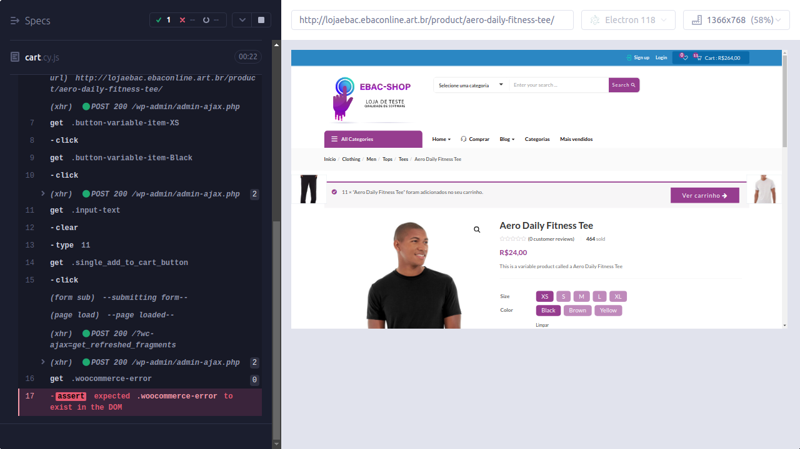

# docs

Esta pasta guarda:

- `TCC-Enrico-Alencar-Tomaz.docx` — o documento final do TCC.
- `defeitos.md` — registro formal dos defeitos encontrados durante os testes.
- `performance.md` — análise dos resultados dos testes de performance (K6).
- `limitacoes-mobile.md` — relato da investigação da automação mobile não concluída.
- `evidencias/` — capturas de tela que sustentam os achados documentados acima.

## Pasta `evidencias/`

Adicione aqui as capturas de tela mencionadas nos documentos desta pasta, seguindo a nomenclatura sugerida:

| Arquivo sugerido | Conteúdo esperado | Referenciado em |
|---|---|---|
| `estrategia-de-testes.png` | Mapa mental da estratégia de teste (item 4.1) | Documento do TCC, seção 4.1 |
| `def-001-carrinho-11-itens.png` | Print do carrinho aceitando 11 unidades do mesmo produto | `defeitos.md` |
| `k6-resultado-login.png` | Saída do terminal com o resultado da execução `k6 run scenarios/login.js` | `performance.md` |
| `k6-resultado-cupons.png` | Saída do terminal com o resultado da execução `k6 run scenarios/coupons.js` | `performance.md` |
| `mobile-busca-sem-resultado.png` | Print do app Android mostrando "No products found" | `limitacoes-mobile.md` |
| `mobile-tela-login.png` | Print da tela de login do app, usada na investigação | `limitacoes-mobile.md` |

Os prints usados durante o desenvolvimento deste trabalho já existem localmente (capturados ao longo da sessão de testes) — basta movê-los para esta pasta com os nomes acima e referenciá-los nos arquivos `.md` correspondentes, por exemplo:

```markdown

```
