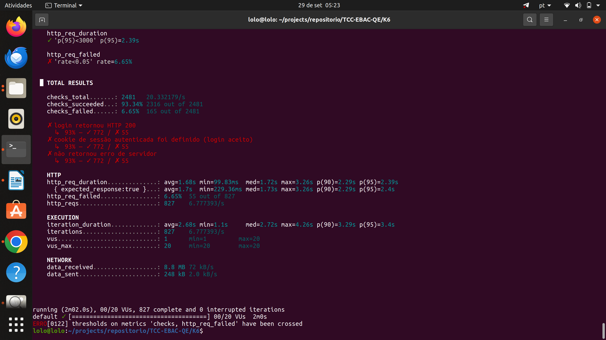
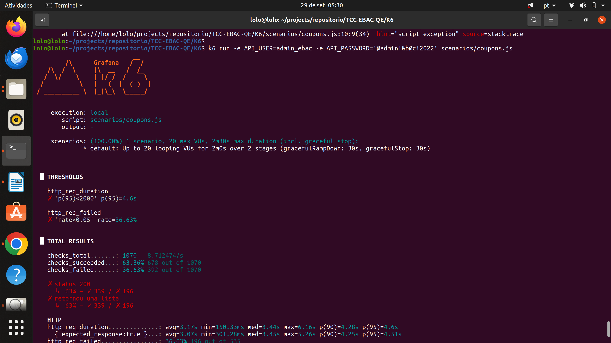

# Resultados dos Testes de Performance (K6)

## Configuração utilizada (conforme especificado no enunciado)

- Usuários virtuais (VUs): 20
- Ramp-up: 20 segundos
- Tempo de execução total: 2 minutos
- Massa de dados (cenário de login): 5 usuários (`user1_ebac` a `user5_ebac`)

---

## Cenário 1 — Login na plataforma (US-0002)

**Script:** `scenarios/login.js`

**Critério de sucesso do login:** a loja responde HTTP 200 tanto para login correto quanto para incorreto (sem redirecionamento), portanto o status HTTP não comprova a autenticação. O critério validado é a presença do cookie `wordpress_logged_in_*`, definido apenas quando o login é aceito. Um teste de controle com senha incorreta confirmou que esse cookie não é definido nesse caso.

Foram realizadas quatro execuções com a configuração exigida (20 VUs, 2 min, ramp-up de 20 s):

| Execução | p95 | Taxa de falha (`http_req_failed`) | Requisições | Observação |
|---|---|---|---|---|
| 1 | 2,29 s | 4,30% | 860 | Validação inicial (apenas status HTTP) |
| 2 | 2,89 s | 3,99% | 852 | Validação com critério de redirecionamento incorreto (ver nota) |
| 3 | 2,66 s | 6,74% | 845 | Mesma validação da execução 2 |
| 4 | 2,47 s | 7,91% | 847 | Validação final (HTTP 200 + cookie de sessão) |

Nota: nas execuções 2 e 3, o check de redirecionamento assumia um HTTP 302 com cabeçalho `Location`, que a loja não devolve; por isso ele falhou em 100% das requisições. Esse check foi substituído. As métricas de tempo e de falha HTTP dessas execuções continuam válidas como medição do servidor.

**Execução 4 (validação final):** das 847 requisições, 780 retornaram HTTP 200 com o cookie de sessão autenticada (100% das respostas que não foram erro de servidor) e 67 falharam por erro de servidor. Os três checks falharam exatamente nas mesmas 67 requisições.

**Conclusão:** o tempo de resposta ficou dentro do limite (p95 abaixo de 3 s) em todas as execuções. Toda resposta que não foi erro de servidor foi um login autenticado de fato. Já a taxa de falha, que ficou abaixo de 5% nas duas primeiras execuções, ultrapassou esse limite nas duas últimas (6,74% e 7,91%). A causa dessa oscilação não foi investigada; portanto não se pode afirmar que o endpoint de login sustenta 20 usuários simultâneos dentro do limite de 5%. O threshold não foi alterado para ajustar o resultado.

---

## Cenário 2 — Listagem de cupons via API (US-0003)

**Script:** `scenarios/coupons.js`

| Métrica | Resultado | Limite (threshold) | Status |
|---|---|---|---|
| p95 do tempo de resposta | 4,56s | < 2s | ❌ Fora do limite |
| Taxa de falha | 40,15% | < 5% | ❌ Fora do limite |
| Tempo médio de resposta | 3,26s | — | — |
| Total de requisições | 523 | — | — |

### Diagnóstico complementar

Para investigar a causa das falhas, foi executado um teste reduzido (`scenarios/diagnostico-coupons.js`), com apenas **5 VUs por 15 segundos**, mantendo a mesma autenticação e endpoint:

| Carga | Taxa de sucesso | Tempo médio de resposta |
|---|---|---|
| 5 VUs | 100% | 885ms |
| 20 VUs | ~60% (falha de 40,15%) | 3,26s (p95: 4,56s) |

Com apenas 5 usuários simultâneos, a API respondeu com 100% de sucesso e tempo médio de 885ms — descartando problemas de autenticação, endpoint incorreto ou erro no script de teste (se fosse esse o caso, a falha ocorreria em qualquer nível de carga, inclusive com 5 VUs).

**Conclusão:** o endpoint `GET /wc/v3/coupons` da API REST do WooCommerce degrada significativamente sob concorrência de 20 usuários simultâneos, apresentando alta taxa de falha (40,15%) e tempo de resposta elevado (p95 de 4,56s). Isso sugere uma limitação de capacidade de concorrência do ambiente (possivelmente relacionada a número de workers PHP-FPM ou conexões de banco de dados disponíveis no ambiente de teste), e não um defeito funcional da API em si — a mesma operação funciona corretamente e com bom tempo de resposta sob carga baixa.

**Recomendação:** investigar a configuração de concorrência do servidor (PHP-FPM, limites de conexão com o banco) caso esse endpoint precise suportar tráfego mais alto em produção.

---

## Comparativo entre os dois cenários

| Cenário | Taxa de falha a 20 VUs | p95 a 20 VUs |
|---|---|---|
| Login (`wp-login.php`) | 3,99% a 7,91% (4 execuções) | 2,29 s a 2,89 s |
| Cupons GET (`wc/v3/coupons`) | 40,15% (1 execução) | 4,56 s |

Sob a mesma carga, o endpoint de cupons falhou em uma proporção muito maior (cerca de 40%) do que o de login (entre 4% e 8%). Como ambos os endpoints apresentaram erros de servidor, a limitação de capacidade do ambiente afeta os dois, e a diferença observada é de magnitude. O cenário de cupons foi executado uma única vez com 20 VUs, então sua taxa de falha também pode oscilar entre execuções.
